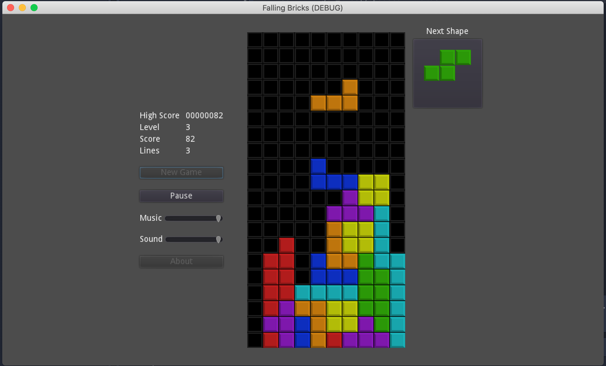

# Falling Bricks

The goal of this project is learning about game programming using
[Godot](https://godotengine.org/) by following
[the Godot Game Development Tutorial (Tetron)](https://www.youtube.com/playlist?list=PLFTE4-k_Qh3tfkbsapJdRBmU0Y8gze_dl)
created by [GDScript Dude](https://www.youtube.com/channel/UCQs0i6vKISElM6mh7OzLouQ).

I modified stuff here and there while going through the tutorial and continued
adding some extra features. Some of these changes/features are:
* Code style. I wrote some parts of the code differently either for
  learning or just because I used different conventions.
* Landscape layout.
* Game stops while clearing complete rows. In Tetron there is a pause using
  yield that doesn't prevent the new shape of start falling down while there
  completed rows are still being cleared. In addition, using yield returns to
  the caller so it continues its execution even when the called function is
  still executing. I added specific checks for completion of the called
  functions in order to control the execution flow.
* Fixed a bug that caused the straight shape (I) not to move to the rightmost
  column when it is rotated 270º.
* Added some extra time to allow to move and rotate the shape before locking
  it to the grid.

I won't keep this list updated with new features or differences with the
original code explained in the tutorial. In case you are here trying to find a direct correspondence with the tutorial, please visit
[Tetron repository](https://github.com/andrew-wilkes/tetron).
I'll try to document the game mechanics and options I implement, and let you
dive into the differences if you want to :-).

# Controls

| Key | Action |
|-----|--------|
| Left arrow | Move left |
| Right arrow | Move right |
| Down arrow | Fast drop |
| Up arrow | Hard drop |
| d | Rotate clockwise |
| s | Roatate counter-clockwise |
| Page up | Increase level |
